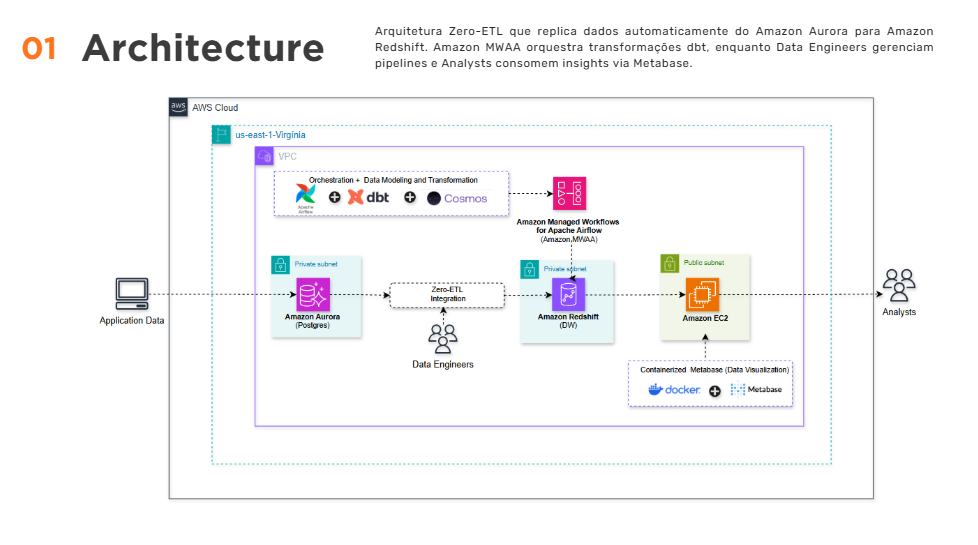

# 🚀 Arquitetura Zero-ETL AWS

[](https://aws.amazon.com/)
[](https://www.terraform.io/)
[](https://www.getdbt.com/)
[](https://airflow.apache.org/)

Pipeline de dados moderno na AWS utilizando **Zero-ETL** para replicação em tempo real do Aurora PostgreSQL para Redshift, com transformações via **dbt** e orquestração com **Airflow (MWAA)**.

## 📋 Sobre o Projeto

Este projeto demonstra uma arquitetura **Modern Data Stack** completa na AWS, eliminando a necessidade de pipelines ETL tradicionais através da integração Zero-ETL. Os dados são replicados automaticamente do banco transacional (Aurora) para o Data Warehouse (Redshift), onde são transformados com dbt para análises.

### Dataset
Utiliza o **MovieLens Dataset** com:
- 🎬 9.742 filmes
- ⭐ 100.836 avaliações
- 🏷️ 3.683 tags
- 👥 610 usuários

## 🏗️ Arquitetura


### Componentes Principais

**Arquitetura Zero-ETL que replica dados automaticamente do Amazon Aurora para Amazon Redshift. Amazon MWAA orquestra transformações dbt, enquanto Data Engineers gerenciam pipelines e Analysts consomem insights via Metabase.**

### Características Técnicas

• **Zero-ETL Real-Time**: Aurora → Redshift sem latência  
• **Infrastructure as Code**: Deploy automatizado via Terraform  
• **Self-Service Analytics**: Dashboards interativos no Metabase  
• **Cloud-Native Design**: Escalável, resiliente e cost-optimized

## 🛠️ Tecnologias

| Componente | Tecnologia | Função |
|------------|------------|--------|
| Banco Transacional | Aurora PostgreSQL | Dados de origem |
| Data Warehouse | Amazon Redshift | Armazenamento analítico |
| Replicação | Zero-ETL | Sync em tempo real |
| Transformação | dbt | Modelagem de dados |
| Orquestração | MWAA (Airflow) | Agendamento de pipelines |
| Visualização | Metabase | Dashboards |
| Data Lake | Amazon S3 | Armazenamento raw |
| Infraestrutura | Terraform | Infrastructure as Code |
| Execução | EC2 + SSM | Scripts remotos |

## 📁 Estrutura do Projeto

```
arquitetura-zero-etl-aws/
├── terraform/infra/          # Infraestrutura como código
│   ├── modules/              # Módulos Terraform (VPC, RDS, Redshift, etc)
│   ├── envs/                 # Variáveis por ambiente
│   └── backends/             # Configuração do state
├── code/
│   ├── dbt/                  # Projeto dbt
│   │   ├── airflow_dags/     # DAGs do Airflow
│   │   └── movielens_redshift/  # Modelos dbt
│   └── insert_data_postgres/ # Scripts de carga
├── data/ml-latest-small/     # Dataset MovieLens
└── metabase/                 # Docker Compose do Metabase
```

## 🚀 Quick Start

### Pré-requisitos
- AWS CLI configurado
- Terraform >= 1.0
- Python >= 3.8
- Docker (para Metabase)

### 1. Clone o repositório
```bash
git clone https://github.com/euvanessa-prado/arquitetura_zero_etl.git
cd arquitetura_zero_etl
```

### 2. Crie o bucket para Terraform State
```bash
aws s3 mb s3://terraform-state-data-handson-mds-dev --region us-east-1
```

### 3. Provisione a infraestrutura
```bash
cd terraform/infra
terraform init -backend-config="backends/develop.hcl"
terraform apply -var-file=envs/develop.tfvars
```

### 4. Carregue os dados
```bash
# Upload CSVs para S3
python code/insert_data_postgres/upload_to_s3.py

# Inserir no Aurora (via EC2/SSM)
python code/insert_data_postgres/insert_postgres_simple.py
```

### 5. Verifique a replicação
```bash
# Verificar dados no Redshift (após Zero-ETL replicar)
python code/insert_data_postgres/test_redshift_connection.py
```

## 📊 Fluxo de Dados

1. **Ingestão**: CSVs do MovieLens são enviados para o S3
2. **Carga**: Dados são inseridos no Aurora PostgreSQL
3. **Replicação**: Zero-ETL replica automaticamente para Redshift
4. **Transformação**: dbt cria modelos analíticos
5. **Visualização**: Metabase consome os dados transformados

## 📈 Dashboard Analytics



### Insights Disponíveis

O dashboard do Metabase apresenta análises completas do dataset MovieLens:

- **📊 Popularidade por Gênero**: Distribuição de filmes por categoria
- **⭐ Média Geral de Avaliações**: Score médio de 3.5/5.0 
- **📈 Tendências Temporais**: Evolução das avaliações ao longo dos anos
- **🎬 Top 10 Filmes**: Ranking dos filmes mais bem avaliados
- **📊 Análise por Trimestre**: Padrões sazonais de avaliações
- **🔍 Detalhamento por Gênero**: Insights específicos por categoria

### Métricas Principais

- **6.287** avaliações processadas
- **Média de 3.5** estrelas por filme
- **Análise temporal** de 1995 a 2018
- **Distribuição por gênero** com foco em Drama, Comédia e Thriller

## 🔐 Segurança

- ✅ Credenciais no AWS Secrets Manager
- ✅ RDS/Redshift em subnets privadas
- ✅ Encryption em repouso
- ✅ Acesso via SSM (sem SSH exposto)
- ✅ Dados sensíveis removidos do código

## 📚 Documentação

- [ARCHITECTURE.md](ARCHITECTURE.md) - Detalhes da arquitetura
- [code/insert_data_postgres/README.md](code/insert_data_postgres/README.md) - Guia de carga de dados

## 🔗 Links Úteis

- [AWS Zero-ETL](https://docs.aws.amazon.com/redshift/latest/mgmt/zero-etl.html)
- [dbt Documentation](https://docs.getdbt.com/)
- [MWAA Documentation](https://docs.aws.amazon.com/mwaa/)
- [Terraform AWS Provider](https://registry.terraform.io/providers/hashicorp/aws/latest/docs)
- [MovieLens Dataset](https://grouplens.org/datasets/movielens/)

## 📝 Licença

Este projeto é para fins educacionais e de demonstração.

---

Desenvolvido com ☕ por [Vanessa Prado](https://github.com/euvanessa-prado)
